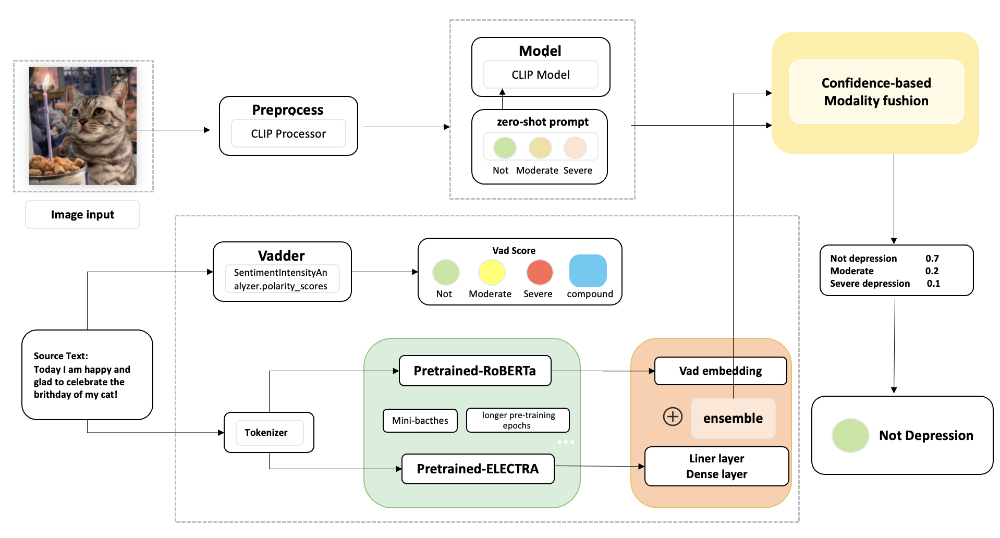

# Enhancing Depression Detection in Social Media using Multimodal methods: A Scalable Approach for Improved Accuracy and Efficiency

> Our architecture:

> Frontend demo:

https://github.com/ProsperousYe/WALL-E-Detector.git

> See our reports and experiments, as well as derived insights:

https://drive.google.com/file/d/1_m1JyPbN6DfUmz7r7rYWUAQViSTZPv1b/view

> Notable Reference - Some of the text-related ideas are adpoted from

https://github.com/wywyWang/Depression-Detection-LT-EDI-ACL-2022

### Developers
Zihan Zhou, Xiaokang Ye, Pangyu Li, Yuheng Liu
